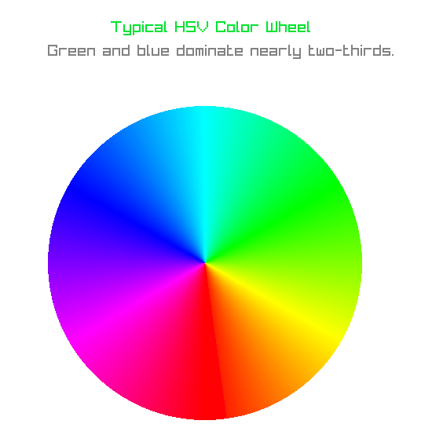
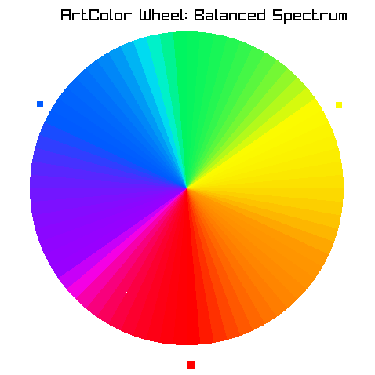
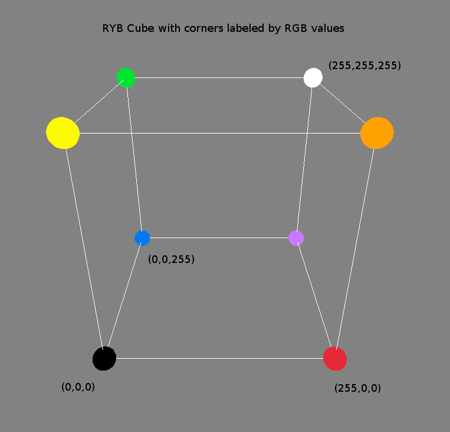
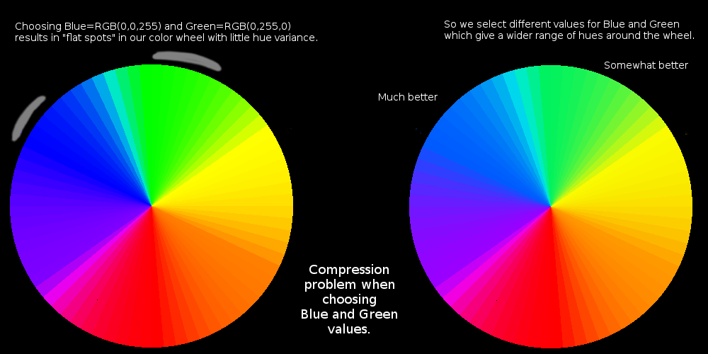
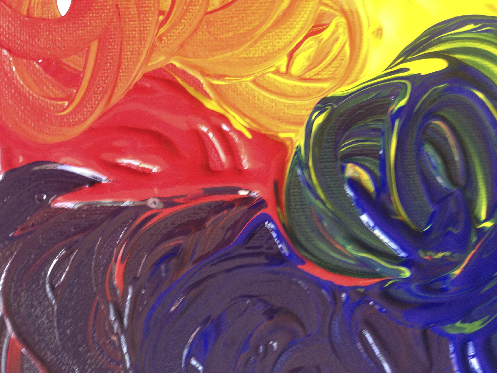
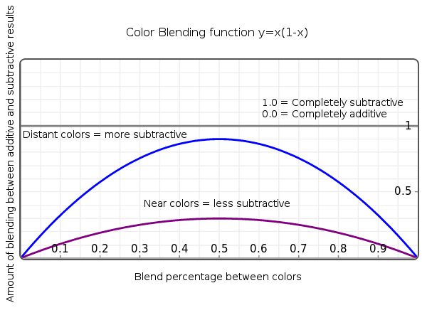
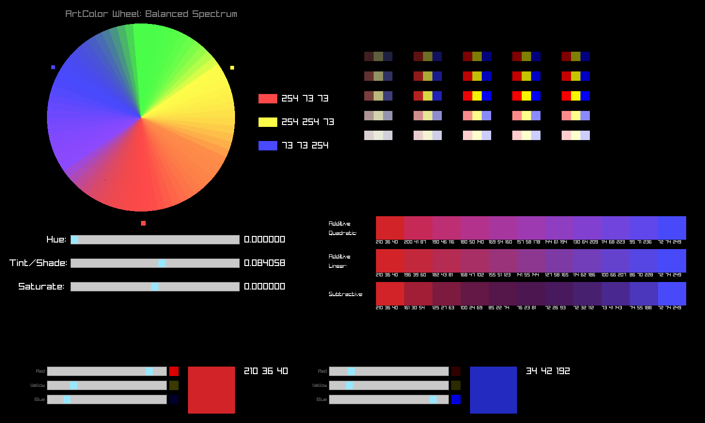
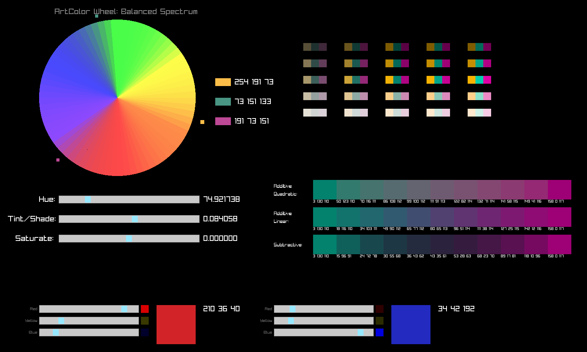
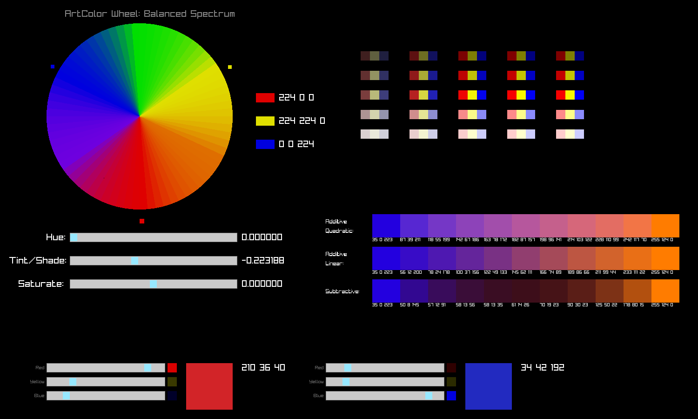
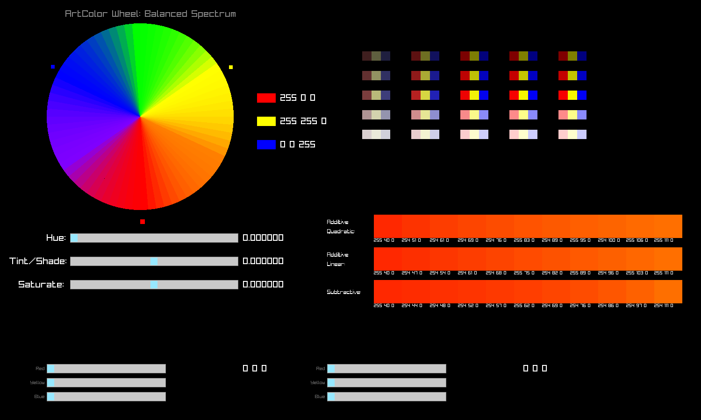

# ArtColors
Intuitive color mixing in subtractive Red-Yellow-Blue color space.  A traditional art school color wheel and palette selector provides triadic, split-complementary and tetradic color harmonies.  RGB-to-RYB conversion with simple formulas.  Built with RayLib.

# Uses
1. **Intuitive color mixing for graphic design, data visualization, GUI creation or video game graphics.**

   Everyone grows up learning that red and yellow make orange.  The RGB space is unintuitive.
   
2. **Easy generation of harmonious palettes for pleasing graphic design.**

   Color schemes in fine art are based on simple geometric relations on an RYB color wheel which has red, yellow and blue primaries 120 degrees apart.  The typical RGB color wheel has red, green and blue 120 degrees apart, so these relations fail.  The blue-green spectrum tends to dominate, obscuring rich yellows, purples and browns.
   
3. **Portable simple formulas for RYB-to-RGB conversion and subtractive color mixing.**

   There is a lot of literature on subtractive color mixing.  My approach aims for a compromise between simplicity and accuracy, with much less code than a reflectance-based approach.
   
# Challenges and Design Principles of ArtColors
A brief summary of the challenges of designing a subtractive Red-Yellow-Blue color space explains the principles I used to design ArtColors.  It also summarizes many of the things I learned while researching this project, and so I offer it in case it is instructive to others.

Hereafter common color space names will be abbreviated as follows:

**RYB-**=*Subtractive Red-Yellow-Blue color space*  Our color system.  
**RGB+**=*Additive Red-Green-Blue*  The system most widely used for monitor display. [Wiki](https://en.wikipedia.org/wiki/RGB_color_model)  
**HSV**=*Hue-Saturation-Value*  An alternative representation of the RGB+ system.  [Wiki](https://en.wikipedia.org/wiki/HSL_and_HSV)  
**CYMK**=*Cyan-Yellow-Magenta-Black*  A subtractive system, most frequently used in printing.  [Wiki](https://en.wikipedia.org/wiki/CMYK_color_model)  

## Challenge #1: Everyone learns color mixing using RYB- primaries
From the time you first played with crayons or fingerpaints, you've been using an RYB- color space.  Red plus green make a murky brown, but in RGB+ they make yellow.  Red and blue make a dark purple, but in RGB+ they make a bright magenta.  This can make it hard to quickly find the colors you want when blending.

RGB+ makes sense for what it was designed to do.  Computer monitors are emissive: they emit light which therefore blends additively.  No painting can do this.  Art media are reflective: the pigments we use absorb incident white light and reflect what they don't absorb.  Thus, they are subtractive: the more pigments one adds, the less light is reflected to the eye.  RGB+ was designed to align its primaries with the colors of light to which the three types of human [cone cells](https://en.wikipedia.org/wiki/Cone_cell) in the eye are most responsive.  Any sufficiently distinct set of primaries could have been chosen, but RGB was chosen for basically two reasons: the physiology of the human eye, and RGB are "spectral" colors -- colors seen when passing white light through a prism.  The disadvantages are: the vast majority our experience mixing colors is in a subtractive space, and many colors in our experience are non-spectral (see below).

Moreover, traditional instruction in art still uses RYB- to teach color theory.  Traditional art color theory has a long and complex history, in part driven by the range of pigments available to artists and their vast experience.  While the theoretical formalization of this body of knowledge into RYB- was premised in part on erroneous 19th century ideas of the physics of color, the approach is still fundamentally valid -- as evidenced by the fact that artists, who devote enormous study to color -- still use it as a reference.  The success of RYB- does not depend on its ability to theoretically unify the physics of light and human physiology, but on its *empirical validity* to accurately predict what color will result from subtractive color mixing.

Thus almost everyone who has ever taken an art class or read a book on art color theory has encountered the standard RYB- color wheel:  


### Principle #1: ArtColors should mimic a standard RYB- color wheel

## Challenge #2: RGB+ and HSV color wheels are blue-green dominated
Because two of the three primaries are *green and blue*, the yellow-orange range is severely compressed, purple is likewise narrow and dominated by magenta.  One has to be sniper to select these hues.  Small changes in RGB values or HSV hue quickly sweep through these ranges of color.

Compare the standard HSV color wheel with the ArtColor color wheel to see the problem and its solution:
 

### Principle #2: ArtColors should make it easy to select a wide range of hues by balancing the spectrum
The ArtColor Wheel broadens the yellow-orange spectrum and adds deeper purples, while keeping distinct lines for cyan and magenta.  Note that red, yellow and blue primaries (small squares) are separated by 120 degrees.  This will faciliate traditional palette selection and blending (see below).  *How* to transform RGB+ to RYB- is where the math gets interesting.

If you are the inquisitive sort who wonders why RGB+ fails at providing a balanced spectrum of colors, there are two reasons.  The first we can summarize by analogy: green and blue aren't very "orthonormal" in our color experience.  But this merely begs the question: why not?  The answer is not trivial.  Indeed the question is even more perplexing when one considers that RGB is based in part on the physiology of human cone cells.  Shouldn't green and blue *seem* orthonormal to us insofar as they are aligned to the "vector bases" of our cone cell "inputs"?  The answer is that our *psychological* perception of color is not a direct result of human cone cell neuron response curves.  The brain *does its own mixing* to create colors we commonly experience but are not aligned to the frequency-response curve of any one cone cell.  These colors are [non-spectral colors](https://en.wikipedia.org/wiki/Spectral_color#Non-spectral_colors): you don't see them in prismatically separated light.

Non-spectral colors include:  
* *All grays!* (thank you, rod cells)  
* *All tints and shades* = art terms for adding white or black respectively to a "pure" color.  All mixtures of a spectral color plus any shade of gray (from white to black) result in a non-spectral color.  In physical media, this happens all the time!  
* *Important hues like purple* (and any tint or shade thereof, like pink or rose).  "Purple" isn't a spectral color: the perception of purple is the psychological result when the brain receives stimuli from *both* the red-sensitive and blue-sensitive cone cells at the same time.

So RGB is based on the physics of emitted light, and its primaries are selected based on the physiology of human cone cells.  But RGB *doesn't* factor in higher-level yet *intrinsically human* neurological factors of how the brain generates certain color perceptions that are non-spectral.  Art color theory was attentive to this fact from mere experience, even without understanding of the underlying causes.  In this regard, they were better empiricists, and RYB- theory reflects that advantage in my opinion.


## Challenge #3: Preserve traditional color harmonies in palette selection
The term [color harmony](https://blog.thepapermillstore.com/color-theory-color-harmonies/) is used in art to describe the theory of choosing attractive palettes which achieve different artistic effects.  In a *musical* harmony, notes played at the same time need to be sufficiently distinct to avoid dissonance, but the separation between the notes achieves the overall feeling of the chord (major chord vs. minor, etc.).  So likewise in a *color* harmony, colors are chosen that pair together to achieve a palette that produces a certain aesthetic effect.  (A bonus for *color* harmonization, unlike music, is that a narrow range of colors (called analogous) are not dissonant.)  A "complementary color" is its "opposite" on the traditional color wheel, which has its roots in the after-image one sees after looking at a bright color then looking at white.

A book on color theory for painting will effectively demonstrate how a painter's choice of palette greatly impacts his artwork.

On a traditional artist's color wheel, the theory of color harmonies is neatly summarized by the geometrical relationships seen in the central circle of the wheel:


The traditional palette schemes and their geometries in RYB color space are:
* Triadic

   Colors separated by 120 degrees
* Split Complementary

   Two other colors offset by 30 degrees from the complementary color of the first.
   
* Square Tetradic

   Colors at 0, 90, 180, 270 degrees.  Two sets of complementary colors, separated by 90 degrees.
   
* Rectangular Tetradic

   Colors at 0, 120, 180, 300 degrees.  Pick two complementary colors.  For each, find their two triadic harmony colors and make these four a set.  These latter four colors make up the rectangular tetradic scheme.

**The problem: These geometrical relations depend on RYB primaries separated by 120 degrees, which RGB does not provide.**
Thus an RGB or HSV color wheel makes it difficult to select traditional harmonious palettes because green, not yellow, is 120 degrees from red and blue.  Even some sophisticated online color pickers claim to provide these color harmonies, but they fail because they use the correct degrees of separation, but the wrong basis (HSV), yielding incorrect colors.

### Principle #3: ArtColors should provide traditional color harmony palettes using the above geometrical relationships on an RYB color wheel.
Harmonious palette selection should be as easy as rotating the Artist's color wheel.  Pick one color, and the others are automatically selected.  A palette using these hues, their tints, shades and mixtures, can then be automatically exported.  Export can include something simple as invoking a function with one color as input, and returning an array of harmonious colors.

## Challenge #4: RGB to RYB translation
There is a lot of literature on the standard color spaces (RSV, HSV, CMYK, CIELAB, etc.) and the mapping functions between them have all been nicely defined.  There is much less written on RGB to RYB translation.

### RGB to RYB
The ArtColor algorithm for translating from RGB to RYB uses [trilinear interpolation](https://en.wikipedia.org/wiki/Trilinear_interpolation).  First, construct a cube.  The bottom left corner is black.  Each dimension is associated with a primary color in RYB space.  Thus, the bottom right front vertex represents peak red value and the x-axis the range of reds.  The top left front vertex is yellow, with the y-axis representing the yellow range.  The botton left back vertex is blue, with the z-axis representing the blue range.  The vertex diagonally opposite black is white.  The remaining vertices correspond to the secondary RYB colors obtained when mixing our primaries: green (=blue+yellow), orange (red+green) and purple (red+blue).

We then assign RGB values to each of these RYB vertices.  We can thus translate every color in the RYB space to RGB by a trilinear interpolation, following the useful paper by [Gossett and Chen][1].  A picture is worth a thousand words here:



In the code itself, we use normalized float values (0.0 to 1.0) for our coordinates rather than 8-bit integer triplets (0-255,0-255,0-255) to avoid rounding error in our functions.  We translate back to 8-bit integers at the end for RGB display.

While RYB red is defined as (255,0,0), the choice of RGB value for RYB blue and yellow is not straightforward.  Choosing RGB (0,0,255) for blue initially seems obvious, but our primary color values must be chosen to facilitate a range of hues around our RYB color wheel.  We are, in effect, compressing the very broad RGB green-blue range to expand the yellow-orange range (and the purple range to a lesser degree).  Choosing RGB values for blue and green that are too intense will result in little hue variance around these two points on the color wheel, resulting in "flat spots" in our spectrum.  To give a richer spectrum of hues, different values were chosen, using a slightly darker green and slightly brighter blue.  Here is an example of the problem:



Choosing RGB values for Blue and Green which optimize the whole spectrum is also important for the generation of color harmony palettes.  "Flat spots" in the spectrum result in hues which don't vary smoothly as the other colors in the palette vary, resulting in similar blues and greens for palettes which *should* be different.

There is no single "canonical" way to assign RGB values to our RYB space.  To my knowledge, there's never been a standard for RYB-.  As such, I exercised my judgment using reference colors from sites which give RGB equivalents to oil/acrylic paint hues as a guide. The same goes for assigning RGB values to the RYB secondary colors of orange and purple.  I tried to keep these values close to art colors which use these hue names, although there is variation in what is considered "ideal" orange and "ideal" purple.  I aimed to keep purple distinct from magenta (which is more red than blue) and a "middle of the road" orange between red and yellow.  The only choices which are indisputable was assigning Black=RGB(0,0,0) and White=RGB(255,255,255).  A different red could have been chosen, but since red is not in the "problematic" green-blue range, full RGB(255,0,0) red seemed to work very well.

### RYB to RGB (Inverse function)
Placeholder

## Challenge #5: Subtractive Color Mixing
The paint and dye industry has figured out this problem.  The best solution to replicating subtractive color mixing in an RGB+ display involves calculating the reflectance spectrum of each component pigment: the amount of light reflected for every wavelength in the visible spectrum measured in 10nm increments.  Then this data is stored in a table.  (Some tables for sRGB colors also exist.)  Then one of several algorithms, often iterative for accuracy, are used to blend these reflectances and produce an RGB color.  This is the "right" way to do it.

It is also the cumbersome way.  For a graphics artist who is *not* trying to exactly replicate real-world pigments but who just wants to subtractively and intuitively mix colors, something far simpler should do.  Short formulas on StackExchange often give [poor results][2], although some software packages provide this functionality effectively, like Krita painterly mixer using the Kubelka-Munk algorithm.  But this algorithm is still fairly complex.

### Principle #5
ArtColors should provide a simple function call that subtractively mixes two colors in a realistic way with a minimum of code, taking only two RGB inputs and a blending ratio, like this: `Return Color=Mix(Color a, Color b, percentage)` 

ArtColors uses an algorithm which (I think) gives pretty good results with a fraction of the code, and no need for calculating or storing reflectance data or computationally complex formulas.  The goal is 80% realism with only 20% of the code.

The basic approach was inspired by considering how paints actually mix.  Examine this close-up of paints mixing:



If you look carefully, you can see that in some areas, the two paints are completely blended, and the result is subtractive: yellow and blue are making a much darker green.  Red and blue are making a *very* dark purple.  Yet in other areas, where the blending is not so thorough, fine lines of yellow and blue exist side-by-side.  These paints are reflecting yellow and blue *light.*  At a distance, these colors are *additively* blended by the eye when the distict swirls are too small to be seen.  

Consider further that mixing paints is a *mixture* in the Chemistry sense: no *chemical* change happens.  The red and blue molecules are still there in the thorough blend, doing exactly what they were doing when separate: reflecting red and blue light.  There's just a lot of subsurface physical effects going on as light bounces around in the medium.  Incident light is absorbed and reflected by one molecule, and then by another, and eventually the result reflects out to the eye.

How does this help solve our problem?

Strictly subtractive approaches start with White, and then subtract the RGB values of Color A and Color B from White, and return what is left.  *This approach is often too dark.*  Why?  Some of each pigment is still reflecting its distinctive color on a tiny scale.  If we take an approach that is *part additive, part subtractive*, we get a more realistic result!

Moreover, if Color A = Color B, our function should return that same color.  Mixing the same color with the same color should equal the same color!  Using a strictly subtractive algorithm, the result is a darker version of the original hue (because the input color values are subtracted from White *twice*).  The closer the two input colors, the *less* change should be seen in the blend.  

The ArtColor code for subtractive mixing is:
```
Color ColorMixSub(Color a, Color b, float blend) {
    Color out;
    Color c,d,f;

    c=ColorInv(a);
    d=ColorInv(b);

    f.r=max(0,255-c.r-d.r);
    f.g=max(0,255-c.g-d.g);
    f.b=max(0,255-c.b-d.b);

    float cd=ColorDistance(a,b);
    cd=4.0*blend*(1.0-blend)*cd;
    out=ColorMixLin(ColorMixLin(a,b,blend),f,cd);

    out.a=255;
return out;
}
```
Explanation of Code:
`Color a` and `Color b` are the input colors.  `blend` specifies how much of each color to blend, from 0 to 1.0, like a linear interpolation (LERP).  0.0 = All color A, 1.0 = All color B.  0.5 = 50%-50% mix of A and B.

First we find the RGB inverses of Color a and b, and assign them to new colors c and d.
```
    c=ColorInv(a);
    d=ColorInv(b);
```
Then we subtract both c and d from pure RGB White, clamping the result to zero, and assign the result to color f.
```
    f.r=max(0,255-c.r-d.r);
    f.g=max(0,255-c.g-d.g);
    f.b=max(0,255-c.b-d.b);
```
So far, f is the purely subtractive result, which suffers from the problems mentioned above.

Next, we calculate the "Color Distance" between Color a and Color b, which is just the vector distance between them in RGB space, normalized between 0.0 (identical colors) and 1.0 (completely opposite, like white and black).
```
float cd=ColorDistance(a,b);
```
This value will help solve the problem that mixing two similar hues should not change the result very much.  The color distance factor `cd` is then tranformed by a quadratic transfer function, which regulates how much subtractive and additive mixing we do:
```
cd=4.0*blend*(1.0-blend)*cd;
```


The endpoints ensure that blend percentages near 0% or 100% look very close to the original input colors.  The quadratic curve gives a good color gamut for the mix that comes next.  The peak of the curve is determined by color distance.  The output of this function determines the amount of additive vs. subtractive blending in our result.  More distant colors will blend with a more subtractive dynamic (fully subtractive at y=1.0).  Similar colors blend with a more additive dynamic (a flatter curve) that still has a subtractive factor.  The maximum of the quadratic transfer function is the normalized color distance, so colors diametrically opposed in the color space will blend fully subtractively.  

The last line does all the work:
```
out=ColorMixLin(ColorMixLin(a,b,blend),f,cd);`
```
First, we *additively mix* Color A and Color B in the specified `blend` ratio, which is accomplished by `ColorMixLin(a,b,blend)`.  This represents the additive blending effect of those fine swirls of color in the image above and subsurface interaction.  Absence of this factor may be where a strictly subtractive approach yields odd results.  This *additive* result is then blended with our purely subtractive result `color f`, according to the transfer function mentioned above, which is based on the color distance between `Color a` and `Color b`.  

Voila!  A pretty good result occurs for a wide range of input colors.  Examples are below.

### ArtColors provides two different kinds of additive mixing
Someone on StackOverflow kindly shared that the range of RGB values (0-255) came from the square root of camera CCD intensity signals, so the usual linear interpolation of RGB values actually darkens the result somewhat.

Therefore ArtColors provides two kinds of additive mixing.

Linear Additive Mix -- the formula used everywhere:
```
Color ColorMixLin(Color a, Color b, float blend) {
    Color out;
    out.r=(1.0-blend)*a.r+blend*b.r;
    out.g=(1.0-blend)*a.g+blend*b.g;
    out.b=(1.0-blend)*a.b+blend*b.b;
    out.a=(1.0-blend)*a.a+blend*b.a;

return out;
}
```
Quadratic Additive Mix -- we square the RGB values, LERP those, and square root the result.  This mix tends to preserve brightness / intensity somewhat better.

```
Color ColorMix(Color a, Color b, float blend) {
    Color out;
    out.r=sqrt((1.0-blend)*(a.r*a.r)+blend*(b.r*b.r));
    out.g=sqrt((1.0-blend)*(a.g*a.g)+blend*(b.g*b.g));
    out.b=sqrt((1.0-blend)*(a.b*a.b)+blend*(b.b*b.b));
    out.a=(1.0-blend)*a.a+blend*b.a;

return out;
}
```
ArtColors provides all three mixes (Quad Additive, Linear Additive, and Subtractive) for any two input colors, blended in 10% intervals.  The top color bar is Quad Additive, the middle is Linear Additive, and the bottom is Subtractive Mixing in the examples below:

Red and Blue make a dark, rich Purple.


The relatively opposed colors in this triadic palette of Mint-Magenta-Gold blend darker:


Blending three primaries should result in brown -- and it does!  
(Red+Yellow gives the Orange on the right, Blue is on the left.)


Blending two similar colors, like this Vermillion and Orange, should yield results quite close to our inputs.
Yet close inspection of the RGB values of the three color bars shows that quadratic additive is lighter than linear additive, which is lighter than the subtractive mix.


### Footnotes
[1]: http://vis.computer.org/vis2004/DVD/infovis/papers/gossett.pdf
[2]: https://stackoverflow.com/questions/1351442/is-there-an-algorithm-for-color-mixing-that-works-like-mixing-real-colors


